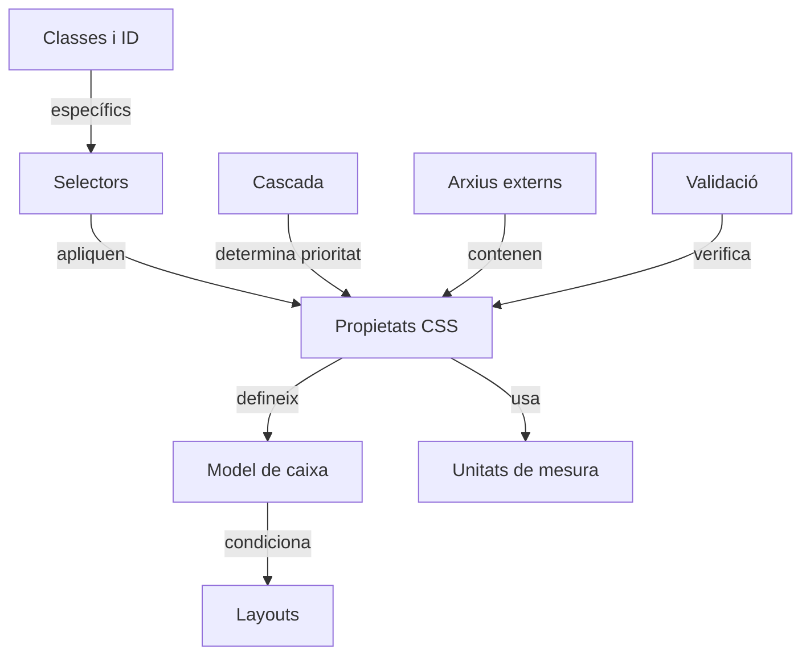

# CSS – Introducció

## Continuació del projecte: El diari digital

> Aquesta tercera activitat amplia el projecte **“El Diari Digital”**, seguint el mateix fil conductor.  
> Després d’haver construït l’estructura HTML i assegurat documents ben formats, ara ens centrarem en **com donar-los forma visual mitjançant CSS** i **eines de disseny web**.

---

## Eines de disseny web

Les **eines de disseny web** permeten crear, editar i visualitzar pàgines amb estils CSS aplicats. L’objectiu és millorar l’eficiència i la coherència en el disseny del nostre diari digital.

### Tipus d’eines
| Tipus | Funció principal | Exemples |
|-------|------------------|-----------|
| **Editors de codi** | Escriure HTML i CSS amb autocompletat i validació. | VS Code, Sublime Text |
| **Eines WYSIWYG** | Disseny visual “el que veus és el que obtens”. | Dreamweaver, Pinegrow |
| **Previsualitzadors** | Mostren canvis CSS en temps real. | Live Server, CodePen |
| **Control de versions** | Gestionar versions del projecte del diari. | Git, GitHub |
| **Validadors** | Comprovar errors sintàctics o d’accessibilitat. | [W3C CSS Validator](https://jigsaw.w3.org/css-validator/) |

### Exemple pràctic

```html
<!DOCTYPE html>
<html lang="ca">
<head>
  <meta charset="utf-8" />
  <title>Diari Digital – Portada</title>
  <link rel="stylesheet" href="styles.css" />
  <style>
    body { font-family: Arial, sans-serif; margin: 2rem; }
    h1 { color: #2a6; text-transform: uppercase; }
  </style>
</head>
<body>
  <h1>Notícies del Dia</h1>
  <p>Comença a aplicar estils CSS a les seccions del teu diari digital.</p>
</body>
</html>
```

**Activitat 1:**  

1. Crea un arxiu `styles.css` extern i enllaça’l al teu `index.html`.  
2. Afegeix una regla per canviar el color de fons i la tipografia general.  
3. Valida el teu full d’estil al [W3C CSS Validator](https://jigsaw.w3.org/css-validator/).

---

## Fulles d’estil (CSS)

Les **fulles d’estil en cascada (CSS)** permeten separar la **presentació** del **contingut**, mantenint una estructura HTML neta i un disseny visual coherent.

### Conceptes bàsics

- **Selectors:** determinen a quins elements s’aplica l’estil.  
- **Propietats i valors:** defineixen l’aspecte (color, mida, marges...).  
- **Cascada:** resol conflictes quan hi ha múltiples regles aplicades.  
- **Model de caixa:** estableix com es disposen els elements (marge, vora, farciment, contingut).  
- **Layouts:** organitzen els blocs de contingut (Flexbox, Grid...).

### Exemple pràctic de CSS extern

```css
/* styles.css */
body {
  font-family: 'Open Sans', sans-serif;
  margin: 0;
  background-color: #f2f2f2;
}

header {
  background-color: #003366;
  color: white;
  padding: 1rem;
}

article {
  background: white;
  border-radius: 8px;
  margin: 1rem;
  padding: 1rem;
  box-shadow: 0 2px 4px rgba(0,0,0,0.1);
}
```

### Diagrama



### 1. Selectors

Els selectors indiquen a quins elements HTML s’aplicaran les regles CSS.  
Són la part inicial d’una declaració CSS, abans de les claus `{}`.

```css
selector {
  propietat: valor;
}
```

#### Tipus bàsics

- De tipus: `p`, `h1`, `div`
- De classe: `.botó`
- D’identificador: `#principal`
- Combinats: `div p`, `ul > li`, `a:hover`

```css
p { color: blue; }
#principal { background-color: lightgray; }
.boto { border-radius: 5px; }
```

---

### 2. Propietats CSS

Les propietats defineixen com es veuran o es comportaran els elements HTML.

**Exemples de propietats**

- De text: `color`, `font-size`, `text-align`
- De caixa: `margin`, `padding`, `border`, `width`, `height`
- De fons: `background-color`, `background-image`
- De posicionament: `display`, `position`, `float`, `flex`

```css
p {
  color: darkgreen;
  font-size: 16px;
  text-align: justify;
}
```

---

### 3. Classes i ID

Serveixen per identificar elements concrets i aplicar-los estils específics:

- Una classe (`.nom`) pot aplicar-se a molts elements.
- Un ID (`#nom`) s’ha d’utilitzar només una vegada per pàgina.

```html
<div id="capçalera">Títol principal</div>
<p class="destacat">Aquest text és important.</p>
<p class="destacat">I aquest també.</p>
```

```css
#capçalera { background: navy; color: white; }
.destacat { font-weight: bold; }
```

---

### 4. Cascada

La cascada determina quina regla s’aplica quan hi ha conflictes entre diferents estils.  
L’ordre de prioritat és:

1. Estils “inline” (dins l’HTML)
2. Selectors d’ID
3. Selectors de classe
4. Selectors de tipus
5. Ordre d’aparició (l’últim predomina)

```html
<p id="text" class="roig">Hola!</p>
```

```css
p { color: green; }
.roig { color: red; }
#text { color: blue; }
```

---

### 5. Model de caixa (Box Model)

Tots els elements HTML són caixes amb:

- Contingut (`content`)
- Farciment (`padding`)
- Vora (`border`)
- Marge (`margin`)

```plaintext
+---------------------------+
|       margin              |
|  +---------------------+  |
|  |      border         |  |
|  |  +---------------+  |  |
|  |  |   padding     |  |  |
|  |  |  content      |  |  |
|  |  +---------------+  |  |
|  +---------------------+  |
+---------------------------+
```

```css
div {
  margin: 20px;
  padding: 10px;
  border: 2px solid black;
}
```

---

### 6. Layouts

Els layouts defineixen com s’organitzen els elements a la pàgina.  
Depenen del model de caixa i de les propietats de posicionament.

**Exemples**

- Flexbox: distribueix elements de forma flexible.
- Grid: organitza en files i columnes.
- Float / Position: mètodes clàssics de col·locació.

```css
.container {
  display: flex;
  justify-content: space-between;
}
```

```css
.grid {
  display: grid;
  grid-template-columns: 1fr 2fr;
}
```

---

### 7. Unitats de mesura

Les unitats de mesura en CSS serveixen per definir dimensions, marges, amplades, alçades o mides de lletra.  
Escollir la unitat adequada és clau per aconseguir un disseny coherent, escalable i adaptable.

#### El meta viewport

Quan treballem amb dissenys adaptatius (responsive), és imprescindible indicar al navegador com ha d’escalar la pàgina segons la mida del dispositiu.

Afegim al `<head>` de l’HTML:

```html
<meta name="viewport" content="width=device-width, initial-scale=1.0">
```

**Què fa aquest tag?**

| Atribut | Funció |
|----------|--------|
| `width=device-width` | Indica que l’amplada de la pàgina ha de coincidir amb l’amplada del dispositiu. |
| `initial-scale=1.0` | Estableix el nivell de zoom inicial al 100%. |

Sense aquest tag, els navegadors mòbils mostren la pàgina com si fos una versió d’escriptori reduïda, i les unitats com `vw` o `%` no s’ajusten correctament.

### Tipus d’unitats

#### Unitats relatives

Depenen d’un altre valor de referència (com la mida de la lletra o la mida de la finestra).

| Unitat | Significat | Exemple pràctic | Descripció |
|--------|-------------|----------------|-------------|
| `em` | Respecte a la mida de lletra de l’element pare | `font-size: 1.5em;` | 1.5 vegades la mida base del contenidor. |
| `rem` | Respecte a la mida de lletra arrel (`html`) | `font-size: 2rem;` | 2 vegades la mida del `<html>`. |
| `%` | Percentatge respecte al contenidor pare | `width: 50%;` | Ocupa la meitat de l’amplada del contenidor. |
| `vw` | 1% de l’amplada de la finestra (viewport width) | `font-size: 5vw;` | El text creix amb la mida de la finestra. |
| `vh` | 1% de l’alçada de la finestra (viewport height) | `height: 100vh;` | Element ocupa tota l’alçada de la pantalla. |

```css
html { font-size: 16px; }
h1 { font-size: 2rem; }
p { font-size: 1.2em; }
section { width: 80%; }
.banner { height: 100vh; }
```

#### Unitats absolutes

Són fixes i no canvien amb la mida de la pantalla.

| Unitat | Equivalència | Exemple | Ús recomanat |
|--------|---------------|----------|----------------|
| `px` | píxels | `width: 300px;` | Pantalla, mides precises. |
| `cm` | centímetres | `margin: 1cm;` | Impressió. |
| `mm` | mil·límetres | `border-width: 2mm;` | Maquetació física. |
| `in` | polzades (1in = 2.54cm) | `width: 3in;` | Impressió. |
| `pt` | punts tipogràfics (1pt = 1/72in) | `font-size: 12pt;` | Documents o PDF. |

```css
div.caixa {
  width: 200px;
  height: 5cm;
  border: 1pt solid black;
  margin: 10mm;
}
```

#### Comparació pràctica

```html
<head>
  <meta charset="utf-8">
  <meta name="viewport" content="width=device-width, initial-scale=1.0">
</head>

<body>
  <div class="bloc1">Bloc amb unitats absolutes (px)</div>
  <div class="bloc2">Bloc amb unitats relatives (%)</div>
</body>
```

```css
.bloc1 {
  width: 400px;
  background: lightcoral;
}

.bloc2 {
  width: 50%;
  background: lightgreen;
}
```

#### Recomanacions pràctiques

- Usa unitats relatives (`em`, `rem`, `%`, `vw`, `vh`) per a dissenys responsius.
- Usa unitats absolutes (`px`, `cm`, `pt`) només quan necessitis precisió fixa.
- Inclou sempre el tag:

```html
<meta name="viewport" content="width=device-width, initial-scale=1.0">
```

- Comprova el resultat amb la vista responsive del teu navegador o editor.

---

### 8. Arxius externs

Els estils poden guardar-se en arxius externs (p. ex. `estils.css`), millorant l’ordre i la reutilització.

```html
<link rel="stylesheet" href="estils.css">
```

```css
body { background-color: #f2f2f2; }
```

---

### 9. Validació

La validació CSS comprova que el codi estigui ben escrit i segueixi l’estàndard del W3C.

**Eines útils**

- [W3C CSS Validator](https://jigsaw.w3.org/css-validator/)
- Extensions de navegador o de VS Code

```css
p { colr: red; } /* Error: propietat mal escrita */
```

---

!!! tip "Idea clau final"
    El CSS transforma l’estructura del teu diari digital en una experiència visual atractiva, coherent i adaptable, sense alterar el contingut HTML subjacent.

