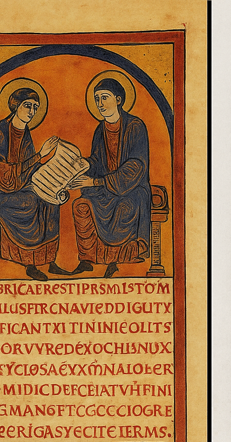
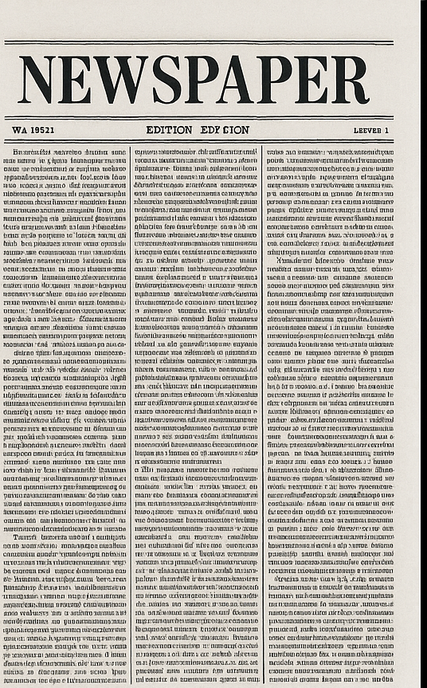
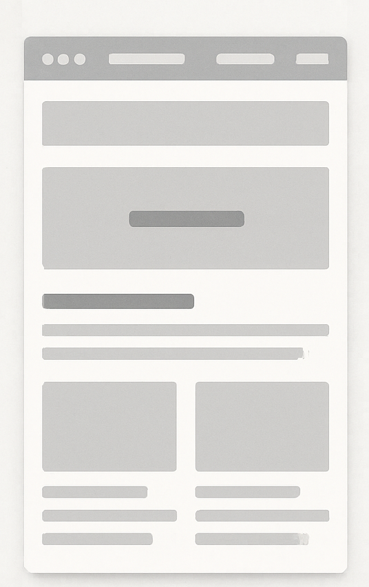
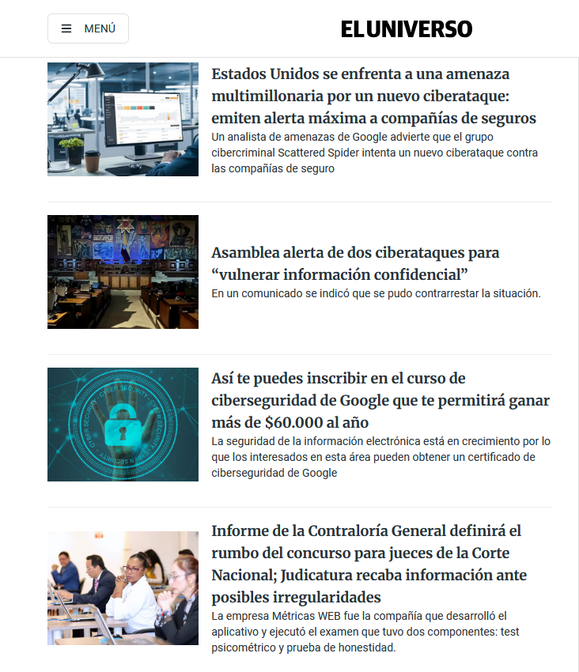

# Lenguajes de marcas  

[Evolución moderna de los lenguajes de marcas](https://prezi.com/p/h2y_lr8ovm_7/evolucion-cronologica-de-los-lenguajes-de-marcas/)

## Objetivo

Comprender cómo a lo largo de la historia se ha organizado el espacio en **áreas de edición** cada vez más definidas y sistemáticas, hasta llegar a los lenguajes de marcas actuales (HTML).

## Evolución de las áreas de edición  

| **Siglo XIII – Manuscrito** | **Siglo XIX – Periódico** | **Actualidad – Página web** |
|------------------------------|---------------------------|-----------------------------|
|  |  |  |
| **Áreas:** ilustraciones, marco, bloque de texto. | **Áreas:** cabecera, columnas, secciones, anuncios. | **Áreas:** header, menú, cuerpo, aside, footer. |
| División **artesanal**, marcada por la decoración. | División **sistematizada** gracias a las rotativas. | División **definida por código** (HTML/CSS). |
| Cada página tiene una organización propia. | Cada ejemplar mantiene un patrón fijo. | El diseño es adaptable y escalable. |

---

## Principios básicos HTML

- Abrir y cerrar
- Definir que lenguaje de marcas voy a utilizar
- Las marcas o etiquetas básicas
- Estructura
- Encabezados
- Párrafos
- Listas
- Imágenes

## Etiquetas HTML y etiquetas semánticas

### Definiciones

- **Tag HTML (etiqueta HTML):**  
  Es un elemento del lenguaje HTML que sirve para marcar partes del contenido de una página web (texto, imágenes, enlaces, etc.). Se escribe entre `< >` e indica al navegador cómo estructurar o mostrar ese contenido.  

- **Tag semántico (etiqueta semántica):**  
  Es una etiqueta HTML que **describe el significado** de la parte de contenido que encierra (por ejemplo `<header>`, `<article>`, `<footer>`). No solo organiza la apariencia, sino que aporta información clara sobre la función del contenido, útil para navegadores, buscadores y accesibilidad.  

### Esquemas semánticos de cada caso

#### 1. Beato de Liébana (s. XIII)

```html
<body>
  <header>
    
  </header>
  <section>
    <article>
      <p>Texto manuscrito principal, acompañado de ilustraciones y decoraciones.</p>
    </article>
  </section>
</body>
```

#### 2. Periódico (s. XIX)

```html
<body>
  <header>
    <h1>Cabecera del periódico</h1>
  </header>
  <section>
    <article>
      <h2>Noticia principal</h2>
      <p>Texto de la noticia distribuido en columnas.</p>
    </article>
    <aside>
      <p>Anuncios y secciones secundarias.</p>
    </aside>
  </section>
  <footer>
    <p>Pie con datos editoriales.</p>
  </footer>
</body>
```

#### 3. Página web actual

```html
<body>
  <header>
    <h1>Cabecera de la página</h1>
    <nav>
      <ul>
        <li><a href="#">Inicio</a></li>
        <li><a href="#">Secciones</a></li>
        <li><a href="#">Contacto</a></li>
      </ul>
    </nav>
  </header>

  <main>
    <article>
      <h2>Título de contenido</h2>
      <p>Texto principal de la página web.</p>
    </article>

    <aside>
      <p>Información adicional o barra lateral.</p>
    </aside>
  </main>

  <footer>
    <p>Pie de página con enlaces legales y créditos.</p>
  </footer>
</body>
```

!!! tip "Idea clave"
    - Las **etiquetas no semánticas** solo sirven como contenedores o para aplicar estilos.  
    - Las **etiquetas semánticas** ayudan a comprender la función del contenido, favorecen la accesibilidad y mejoran el SEO.


!!! tip "Referencias clave"
    - [MSDN](https://developer.mozilla.org/es/docs/Web/HTML/Reference) Referencia completa y ejemplos.
    - [w3schools html](https://www.w3schools.com/Html/html_elements.asp)  Referencia completa y entornos de prueba.
    - [w3schools semántico](https://www.w3schools.com/Html/html5_semantic_elements.asp)   Referencia.

## Primera práctica

### No se nada de html

Comienza a construir esta página a partir de:



[Manual par crear contenido](https://developer.mozilla.org/es/docs/Learn_web_development/Getting_started/Your_first_website/Creating_the_content)

### Conozco html

Demuestralo superando los siguientes grupos de ejercicios y realizando una captura de la nota final de cada uno de ellos y enviándomela. Necesitarás registrarte con tu correo.

[Etiquetas](https://www.w3schools.com/html/exercise.asp?x=xrcise_elements1)
[Encabezados](https://www.w3schools.com/html/exercise.asp?x=xrcise_headings1)
[Enlaces](https://www.w3schools.com/html/exercise.asp?x=xrcise_links1)
[Tablas](https://www.w3schools.com/html/exercise.asp?x=xrcise_tables1)
[Listas](https://www.w3schools.com/html/exercise.asp?x=xrcise_lists_ordered1)