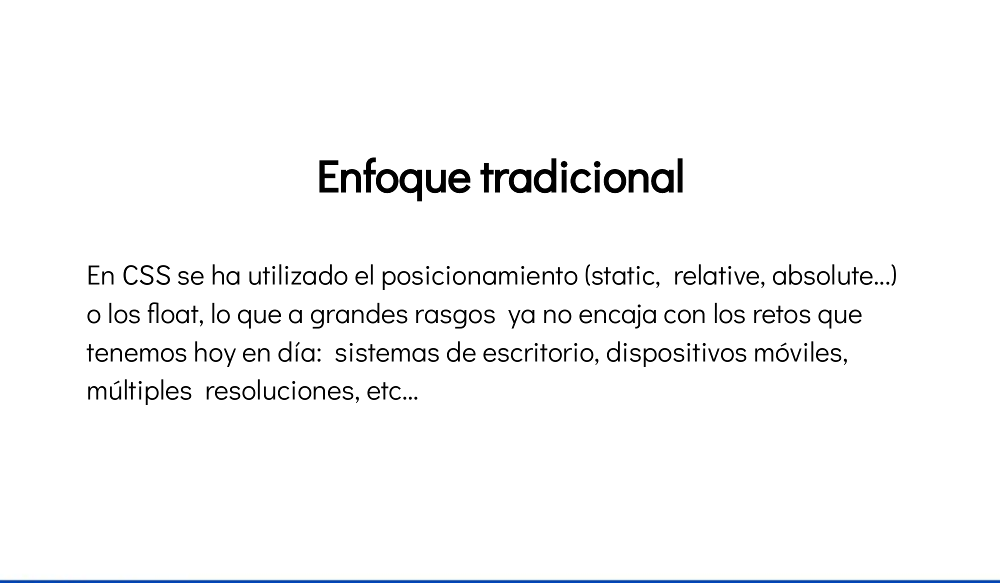
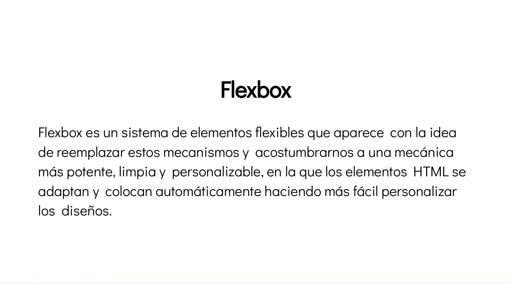
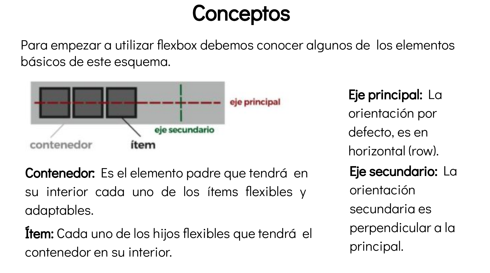
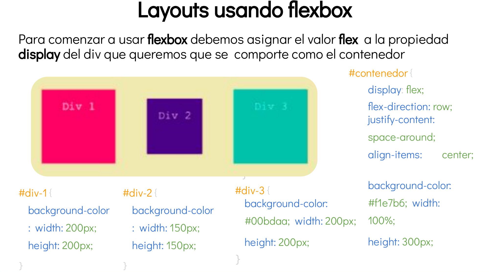
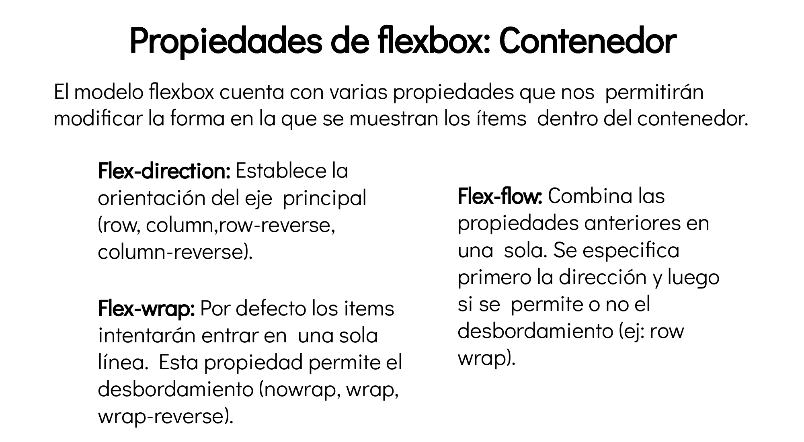
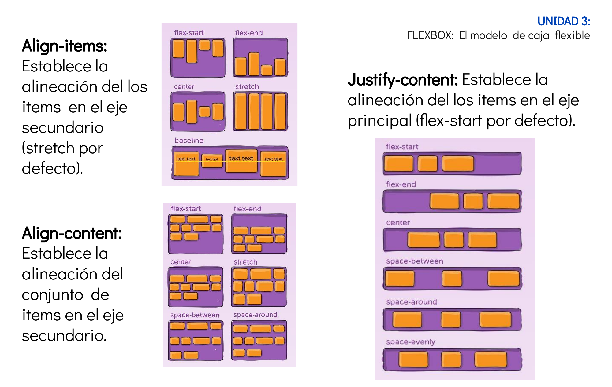
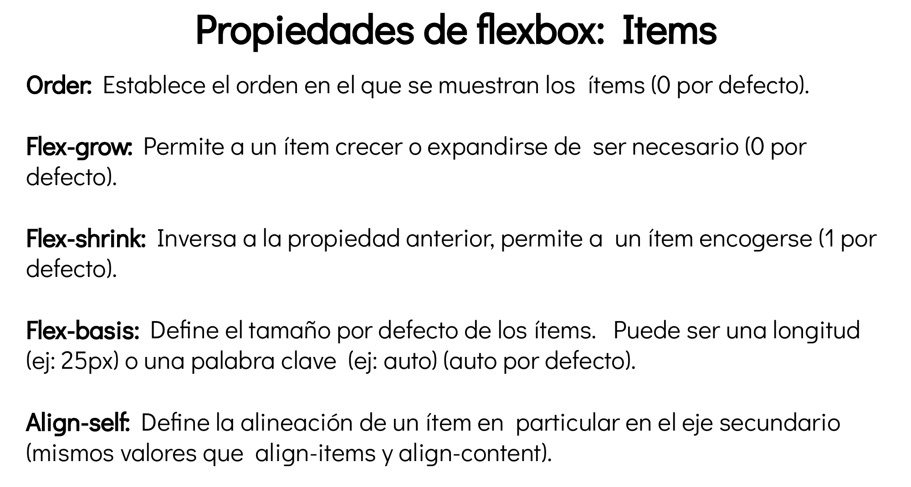

# Flex

## Teoria básica

[Teoria completa en inglés - de paso practicamos inglés](https://css-tricks.com/snippets/css/a-guide-to-flexbox/)

## Práctica

Reproduce tu pagina de practica final con la siguiente herramienta online.

[angrytools](https://angrytools.com/css-flex/)
[w3schools](https://www.w3schools.com/css/css3_flexbox.asp)

A entregar:

1. Disposición noticas en vertical (actual)
2. Disposicón de noticas en horizontal (row)
3. Invertir la posición de la imagen y el texto (de derecha a izquierda o de derecha a izquierda)

** Colocar los tags semánticos en las 3 versiones.

---
